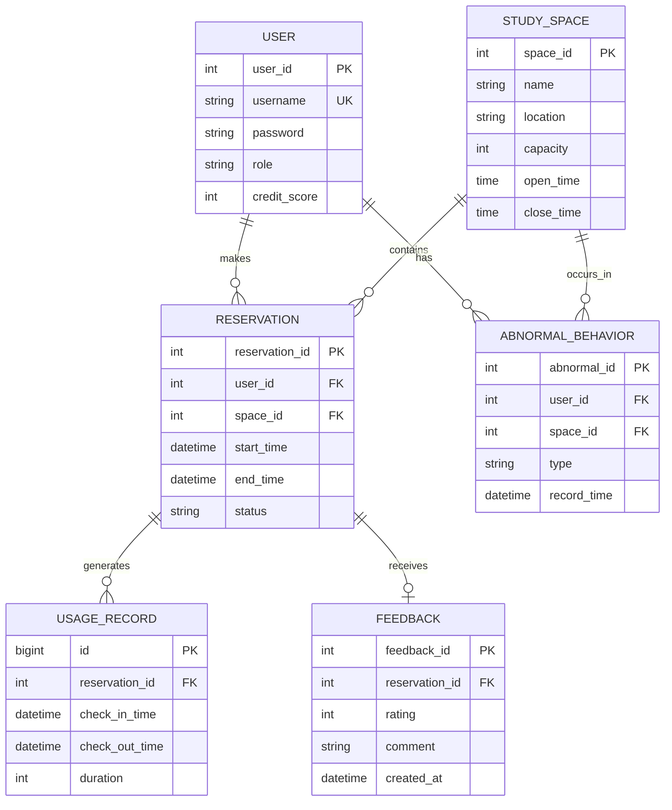

# StuSpace

StuSpace 是一个学习空间预约系统：后端 Django 提供 JSON API，前端使用原生 JavaScript（Bootstrap UI）调用后端接口，数据库为 MySQL。

作业评分点覆盖：
- 功能：登录/注册、空间查询、预约/取消、我的预约、签到/签退、评价、管理员统计与违规检测、信用分约束
- 数据库：ER 图、3NF 说明、关键索引、完整性约束、视图、存储过程、触发器

## 项目结构

- 后端（Django）：[backend](backend)
- 前端（静态页面）：[fronted](fronted)
- 数据库 DDL（交作业）：[docs/schema.sql](docs/schema.sql)

## 运行环境

- Python 3.10+
- MySQL 8.0+（建议；较老版本可能忽略部分 CHECK 约束）

## 一键运行

1) 安装依赖

```bash
pip install -r requirements.txt
```

2) 配置数据库连接

修改 [backend/backend/settings.py](backend/backend/settings.py) 中 `DATABASES['default']`（用户名/密码/端口）。

3) 初始化数据库

方式 A（推荐，和当前系统完全一致）：

```bash
cd backend
python manage.py migrate
python populate_db.py
```

方式 B（纯数据库验收/展示 DDL 能力）：

在 MySQL 执行 [docs/schema.sql](docs/schema.sql)（包含：表/约束/索引/视图/存储过程/触发器 + 最小演示数据）。

4) 启动后端

```bash
cd backend
python manage.py runserver
```

5) 启动前端

使用 VS Code Live Server 打开：
- 登录页：[fronted/login.html](fronted/login.html)

## 演示账号（populate_db 会创建）

- 管理员：`admin / adminpassword`
- 学生（不同信用分，便于演示限制/扣分）：
  - `demo_low / 123456`（55：应被限制预约）
  - `demo_mid / 123456`（60：边界值，可预约）
  - `demo_good / 123456`（80）
  - `demo_high / 123456`（95）

## ER 图



## 范式（3NF）说明

- 1NF：字段原子化（时间/评分/信用分等均为单值字段）。
- 2NF：各表非主属性完全依赖主键（如 RESERVATION 的 `status/start/end/user_id/space_id` 全依赖 `reservation_id`）。
- 3NF：避免传递依赖与冗余：
  - USER 的 `credit_score` 只在 USER 表维护；RESERVATION/ABNORMAL_BEHAVIOR 仅引用 `user_id`。
  - STUDY_SPACE 的 `capacity` 只在 STUDY_SPACE 表维护；预约不冗余容量字段。
  - FEEDBACK 只引用 `reservation_id`，不重复存储 `user_id/space_id`。

## 数据库对象（索引/约束/视图/过程/触发器）

实现都在 [docs/schema.sql](docs/schema.sql)：

- 完整性约束（示例）
  - `reservation(end_time > start_time)`，`reservation.status` 取值约束
  - `user.credit_score` 取值约束，`feedback.rating` 1~5
  - `uniq_feedback_reservation`：同一预约最多 1 条评价

- 关键索引（性能）
  - `idx_reservation_space_time` / `idx_reservation_user_time`：优化“区间重叠（冲突/容量）”查询
  - `idx_abnormal_user_time` / `idx_abnormal_space_time`：优化管理端统计

- 视图
  - `v_space_today_stats`：当天空间统计（预约/完成/异常）

- 存储过程
  - `sp_create_reservation`：在数据库事务里做信用分限制、容量/冲突校验与并发控制示例

- 触发器
  - `trg_feedback_only_completed`：只允许对 `completed` 的预约写入评价

## 功能演示

详见演示视频